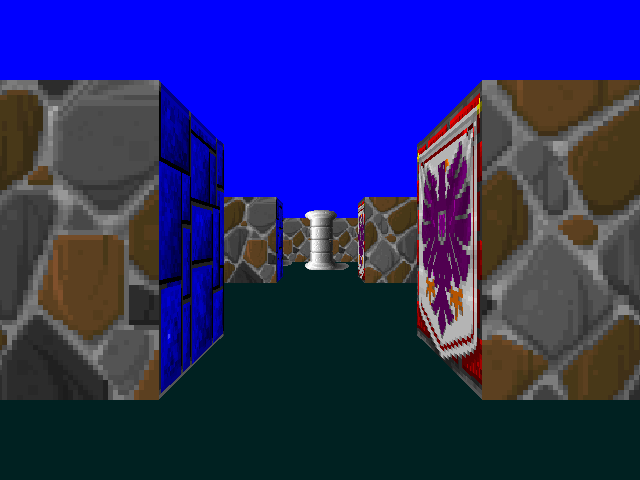
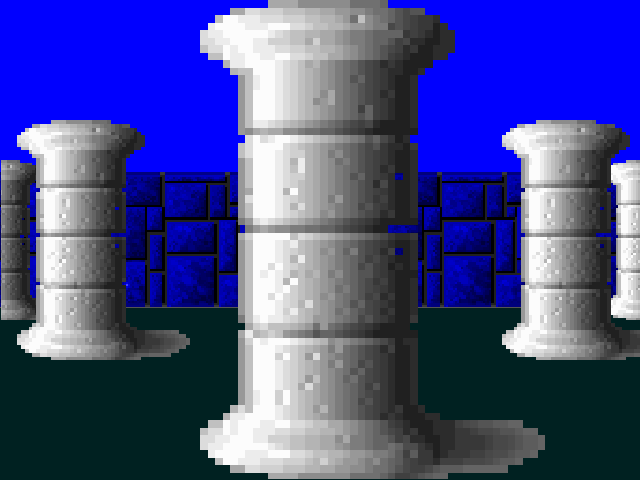
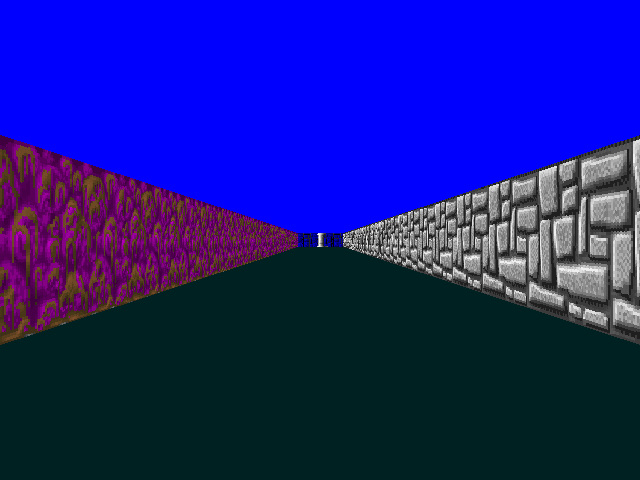

Note: This linux port may be unstable, if you want to run the original version on macos you can checkout the master branch

To compile simply run:
```
make
````

To execute run:
```
./cub3D <path_to_map_file> <--save>
```

--save is optional in order to create a screenshot of the first frame

# Map Requirements

Maps have to respect the following rules:

* map files must end with .cub
* It needs to have a resolution specified
```
R x y
```
* It needs textures specified
```
NO ./path_to_the_north_texture
SO ./path_to_the_south_texture
WE ./path_to_the_west_texture
EA ./path_to_the_east_texture
```
* It needs a sprite texture specified
```
S ./path_to_the_sprite_texture
```
* It needs floor and ceiling colors specified
```
F R,G,B
C R,G,B
```
* The map needs a starting direction and position specified with N S E or A and needs to be fully enclosed
```
11111
10S01
10001
11111
````

* With the exception of the map each type of element can be seperate by one or more empty lines

* With the exception of the map each type of information from an element can be seperated by one or more spaces

Optionally the map can contain sprites, these are indicated with a 2 in the map

With MAP being a valid map for example: maps/wolfen.cub

# Controls
* W - Forward
* S - Backward
* A - strafe left
* D - strafe right
* left arrowkey - rotate left
* right arrowkey - rotate right
* escape - exit Cub3D

# Screenshots





